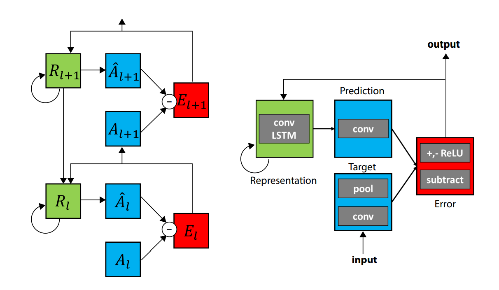
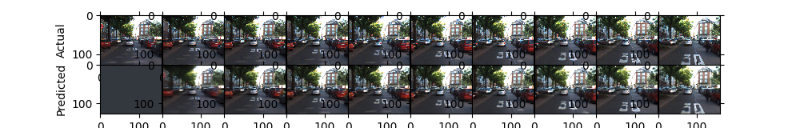
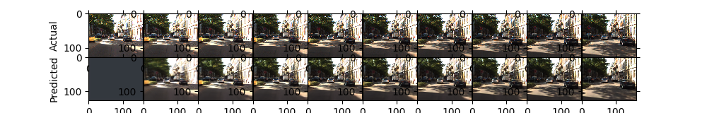

# PredNet-PaddlePaddle

## 目录

* [PredNet-PaddlePaddle](#prednet-paddlepaddle)
  * [目录](#目录)
  * [1. 简介](#1-简介)
  * [2. 数据集和复现精度](#2-数据集和复现精度)
    * [2.1 数据集](#21-数据集)
    * [2.2 复现精度](#22-复现精度)
  * [3. 开始使用](#3-开始使用)
    * [3.1 准备环境](#31-准备环境)
    * [3.2 快速开始](#32-快速开始)
        * [加载官方预训练参数 (仅用于与官方代码对齐)](#加载官方预训练参数-仅用于与官方代码对齐)
        * [训练](#训练)
        * [测试](#测试)
  * [4. 代码结构](#4-代码结构)

## 1. 简介

PredNet是一个利用神经生物学中的预测性编码（Predictive Coding）原理所构建的视频预测模型，预测过程自顶向下，感知过程自底向上，其结构图如下所示。整个网络为层级结构，每一层都会通过R来计算A_hat以预测输入A，两者的差异E再作为输入传递给下一层。其中R为每一层的表征，由一个LSTM来完成对时续信息的整合。特别的是R的输入除了由当前层的误差E外，还包含高层的表征，从而使得顶层的语义信息可以向底层传递。



以下给出两张官方参数的预测结果，第一行为真实图像，第二行为预测图像，第一个时间步网络处于初始化状态，没有外部输入，故输出为0。






**论文:** [Deep Predictive Coding Networks for Video Prediction and Unsupervised Learning](https://arxiv.org/abs/1605.08104)

**参考repo:** [prednet](https://github.com/coxlab/prednet)

在此非常感谢`@coxlab`等人贡献的[prednet](https://github.com/coxlab/prednet)，提高了本repo复现论文的效率。

**aistudio体验教程:** [地址](https://aistudio.baidu.com/aistudio/projectdetail/3190170)

## 2. 数据集和复现精度

### 2.1 数据集

本项目使用[KITTI数据集](http://www.cvlibs.net/datasets/kitti/)进行训练。按照论文中的设置，将RGB图像降采样至128x160。由于原始KITTI数据过大（~165G），作者在[DropBox](https://www.dropbox.com/s/rpwlnn6j39jjme4/kitti_data.zip)上提供了处理过的版本。又由于处理过后的数据为`.hkl`格式，只能在python2中使用hickle 2.1.0进行加载，所以我将数据集转换为`hdf5`格式，上传至[AI Studio](https://aistudio.baidu.com/aistudio/datasetdetail/119650)。本地运行代码的同学可下载三个数据文件放置于`kitti_data`中。

数据分为train，val，test三个数据集，分别包含41396，154，832张图像。每个文件中包含两个变量，`images`为所有图像帧，`sources`是每帧图像
的来源，用于判断帧之间的连续性。

### 2.2 复现精度

采用与原文代码一致的训练参数：batch size 4，epoch 150，samples per epoch 500，优化器Adam，初始学习率1e-3，75个epoch后减小为1e-4。保存验证集loss最低的模型为最优模型。

|数据集|复现精度要求|原始代码库精度|本项目精度|
|-----|----------|------------|---------|
|KITTI|0.007000|0.006995|**0.006900**|

训练日志链接：[log](/logs/train.log)
权重文件链接：[weight](https://github.com/IcarusWizard/prednet-paddle/releases/download/v0.1/prednet_kitti_weights.pdparams)

## 3. 开始使用

### 3.1 准备环境
- 硬件：CPU or GPU
- 框架：
  - python=3.7
  - PaddlePaddle=2.2.0

首先根据机器情况安装paddlepaddle，对于需要训练的同学**强烈建议使用GPU**。对于有GPU的机器使用`pip install paddlepaddle-gpu==2.2.0`，对于没有GPU的机器使用`pip install paddlepaddle==2.2.0`。更多安装方式可以参考[PaddlePaddle官网](https://www.paddlepaddle.org.cn/)。

在安装完PaddlePaddle之后，直接使用`pip install -r requirements.txt`安装其他依赖。

### 3.2 快速开始

#### 加载官方预训练参数 (仅用于与官方代码对齐)
```bash
bash download_original_models.sh
python kitti_evaluate.py --weight_file model_data_keras2/tensorflow_weights/prednet_kitti_weights.hdf5
```

#### 训练
`python kitti_train.py`

#### 测试
`python kitti_evaluate.py`

## 4. 代码结构

```
├── LICENSE
├── README.md
├── data.py # 数据集定义
├── kitti_data # 数据文件夹
│   ├── test.h5 # 测试数据
│   ├── train.h5 # 训练数据
│   └── val.h5 # 验证数据
├── kitti_evaluate.py # 评估脚本
├── kitti_results
│   ├── prediction_plots/ # 测试集预测可视化
│   └── prediction_scores.txt # 测试集指标
├── kitti_settings.py # 路径定义
├── kitti_train.py # 训练脚本
├── prednet.py # 网络定义
├── requirements.txt # 依赖包
└── utils.py # 功能函数
```